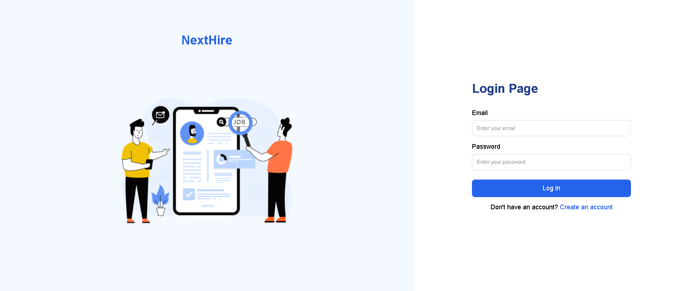
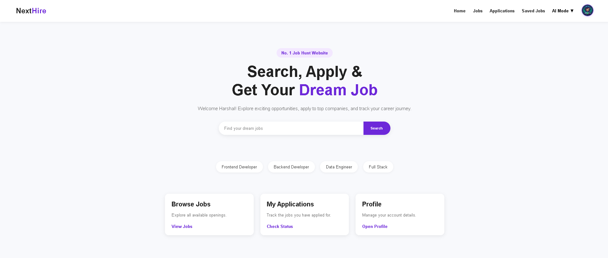
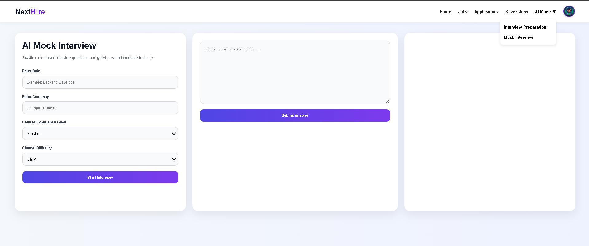
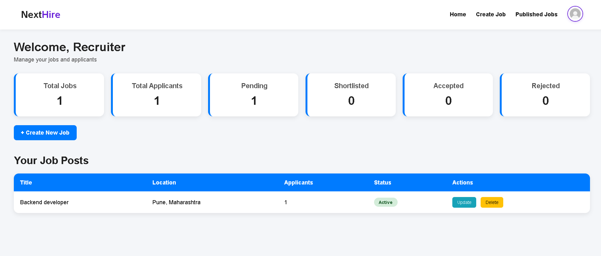
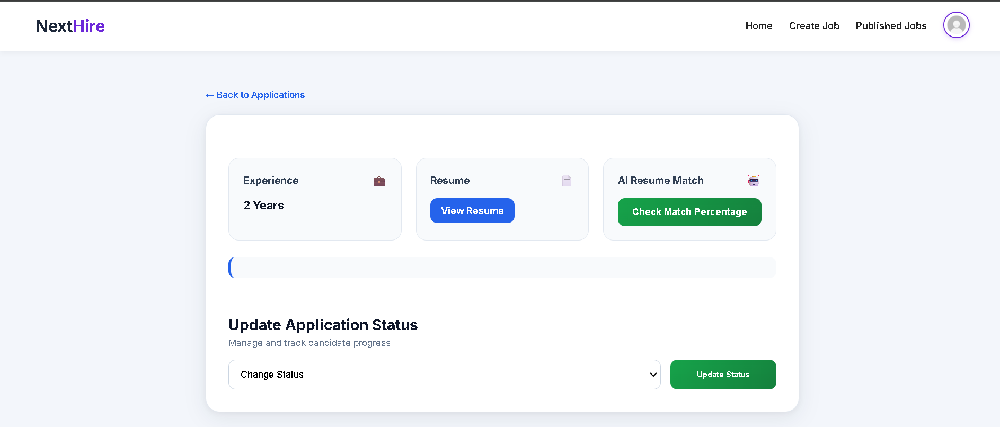

# 🚀 NextHire - AI-Driven Job Portal & Recruitment Engine


NextHire is a high-performance, full-stack AI-powered Job Portal platform designed to bridge the gap between candidates and recruiters using intelligent automation and scalable backend architecture.

Built using a scalable MVC architecture with production-ready deployment practices, the platform integrates AI-driven resume analysis, automated job description generation, recruiter analytics, role-based interview preparation, and cloud-based file management to streamline the modern hiring workflow.

---

# 🌐 Live Demo

[Live Demo](https://jobportal-backend-6sn7.onrender.com)

---

# 📑 Table of Contents

- Features
- Candidate Features
- Recruiter Features
- AI Capabilities
- Tech Stack
- Installation
- Screenshots
- Future Improvements

# ✨ Core Features

## 👥 Role-Based Workflow Architecture

The platform implements a secure and scalable Role-Based Access Control (RBAC) system, providing completely isolated workflows for:

- Candidates
- Recruiters
- Administrative Operations

---

# 👨‍💼 Candidate Feature Suite

### 🔐 Authentication & Authorization
- Secure JWT-based authentication
- Role-Based Access Control (RBAC)
- Protected routes and session handling
- Secure cookie management

### 👤 Dynamic Profile Management
- Create and manage candidate profiles
- Upload and update profile pictures
- Resume upload support using Cloudinary cloud storage

### 💼 Job Interaction System
- Apply for jobs
- Bookmark/save jobs
- Track application status in real-time

### 🔍 Intelligent Job Discovery
- Advanced Searching
- Dynamic Filtering
- Optimized Pagination
- Server-side query optimization for scalable performance

### 🤖 AI-Powered Candidate Assistance
- AI-generated mock interviews
- Role-specific interview preparation
- Dynamic technical interview question generation
- AI-powered compatibility analysis based on:
  - Resume
  - Skills
  - Job Description
  - Target Role

---

# 👩‍💼 Recruiter Enterprise Suite

### 📊 Recruiter Dashboard
- Dedicated recruiter control panel
- Job analytics & candidate tracking
- Application management workflow

### 🧾 Job Management System
- Create, update, delete, and manage job postings
- Manage candidate application statuses
- Archive and monitor hiring pipelines

### 🤖 AI Job Description Generator
Recruiters can generate intelligent job descriptions using AI based on:
- Job Title
- Required Skills
- Employment Type
- Experience Level

### 🧠 AI Resume Screening Engine
- Automated resume analysis
- Semantic resume parsing
- Match percentage generation between:
  - Candidate Resume
  - Job Requirements
  - Skills & Experience

### 📧 Automated Notification System
Integrated email notification pipeline using Nodemailer:
- Status update notifications
- Application lifecycle updates
- Recruiter-to-candidate communication

---

# 🤖 AI Capabilities

### 🧠 AI Resume Analyzer
Automatically evaluates candidate resumes against specific job requirements and generates compatibility scores.

### 🎯 AI Match Percentage Engine
Calculates AI-based match percentages between:
- Resume content
- Job description
- Skill requirements

### 📝 AI Job Description Generator
Generates professional, context-aware job descriptions instantly using AI.

### 🎤 AI Mock Interview Engine
Provides customized:
- Mock interview sessions
- Role-based interview preparation
- Technical interview questions

### ⚡ AI Request Optimization
Implements cache memory mechanisms to:
- Reduce repeated AI API requests
- Minimize resource exhaustion
- Improve response time
- Reduce operational costs

---

# ⚡ Performance Optimizations

- Optimized MongoDB queries
- Server-side pagination
- AI caching mechanisms
- Reduced redundant API calls
- Cloud-based asset management
- Efficient backend routing architecture

---

# 🔐 Security Features

- JWT Authentication
- Role-Based Authorization
- Secure Cookie Handling
- Protected Backend Routes
- Environment Variable Security
- Password Hashing using bcrypt

---

# ☁️ Cloud Infrastructure

### 🌩️ MongoDB Atlas
Production-grade cloud database hosting.

### ☁️ Cloudinary Integration
Cloud-based media and resume storage system.

### 🚀 Render Deployment
Live production deployment and backend hosting.

---

# 🛠️ Tech Stack

## Frontend
- EJS
- CSS
- JavaScript

## Backend
- Node.js
- Express.js

## Database
- MongoDB Atlas

## AI Integration
- Gemini API

## Cloud & Deployment
- Render
- Cloudinary

## Authentication & Security
- JWT
- bcrypt
- Cookies

## Additional Tools
- Nodemailer
- Multer

---

# 📂 Key Functionalities

- Authentication & Authorization
- Resume Upload System
- AI Resume Analysis
- AI Interview Preparation
- AI Job Description Generation
- Job Application Workflow
- Recruiter Dashboard
- Candidate Dashboard
- Bookmarking System
- Search, Filtering & Pagination
- Automated Email Notifications
- Cloud-Based File Storage
- Production Deployment Architecture

---

# 🚀 Installation Guide

## 1️⃣ Clone Repository

```bash
git clone https://github.com/Harshal135701/jobPortal.git
```

---

## 2️⃣ Navigate to Project Directory

```bash
cd jobPortal
```

---

## 3️⃣ Install Dependencies

```bash
npm install
```

---

## 4️⃣ Configure Environment Variables

Create a `.env` file in the root directory and add:

```env
MONGO_URI=
JWT_SECRET=
CLOUDINARY_CLOUD_NAME=
CLOUDINARY_API_KEY=
CLOUDINARY_API_SECRET=
EMAIL_USER=
EMAIL_PASS=
GEMINI_API_KEY=
```

---

## 5️⃣ Start Development Server

```bash
npm start
```

---

# 📸 Screenshots





 

---

# 📈 Future Improvements

- Docker Containerization
- Real-Time Notifications using WebSockets
- Video Interview Integration
- AI Recommendation System
- Advanced Recruiter Analytics
- Admin Dashboard
- Microservices Architecture
- Kubernetes Deployment

---

# 👨‍💻 Author

### Harshal Borse

Passionate Full-Stack Developer focused on:
- Backend Engineering
- AI Integration
- Scalable System Design
- Production-Ready Web Applications

---

# ⭐ Support

If you liked this project, consider giving it a ⭐ on GitHub.

# 📄 License

This project is developed for educational and portfolio purposes.